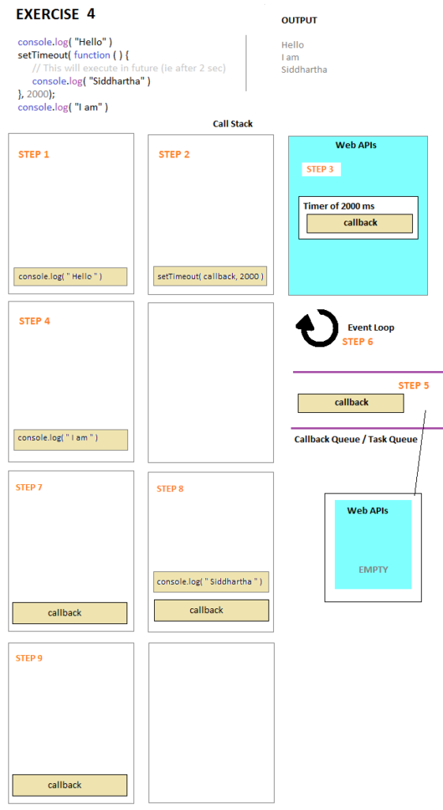
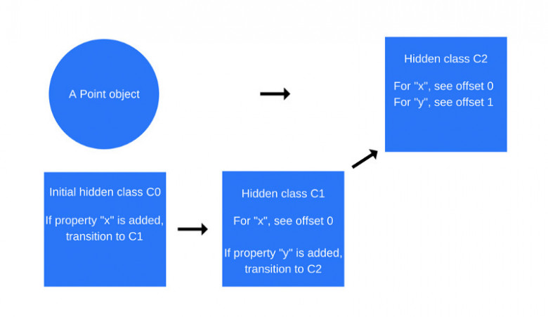

## Общие термины

**JavaScript Engine (движок)** - это программа, которая используется для обработки заданного кода и конвертирования его в конкретные команды для их выполнения. Почти все браузеры имеют на борту JavaScript движок. Самые популярные это V8 в Google Chrome и Node.js, SpiderMonkey от Mozila, Chakra для IE и т.д.    

**JavaScript Run-time Environment** - это среда, отвечающая за создание экосистемы с возможностями, сервисами и поддержкой, такими как массивы, функции, ключевые библиотеки и тп, которые необходимы для того, чтобы код запустился верно.

**JIT-compiling** - это компиляция (компьютерного кода) во время выполнения программы (во время выполнения), а не перед выполнением ("на лету").

**Байт-код** - стандартное промежуточное представление, в которое может быть переведена компьютерная программа автоматическими средствами. Например, операция присваивания в JS a = 42 * spam преобразуется в последовательность инструкций: достать значение из spam, умножить значение на 42, положить значение в a.

**Функциональная схема**

## Движок V8
V8-движок компилирует JavaScript-код в машинные инструкции в ходе исполнения программы, реализуя механизм динамической компиляции без использования промежуточного кода (работает без интерпретаторов). Написан на C++.

### Как работал до версии 5.9 (до 2017 года)
Использует 2 компилятора:
- full-codegen — простой и очень быстрый компилятор, который выдаёт сравнительно медленный машинный код.
- Crankshaft — более сложный оптимизирующий JIT-компилятор, который генерирует хорошо оптимизированный код.

Движок V8 многопоточный. Он содержит:
- Главный поток, который занимается тем, что от него можно ожидать: читает исходный JS-код, компилирует его и выполняет.
- Поток компиляции, который занимается оптимизацией кода в то время, когда выполняется главный поток.
- Поток профилировщика, который сообщает системе о том, в каких методах программа тратит больше всего времени, как результат, Crankshaft может эти методы оптимизировать.
- Несколько потоков, которые поддерживают механизм сборки мусора.

#### Последовательность работы движка V8
1. Запускается компилятор full-codegen, который компилирует и реализует JS код страницы.
2. В другом потоке работает поток-профилировщик, собирая информацию о путях оптимизации кода.
3. После сбора информации потоком-профилировщиком запускается поток компиляции (компилятов Crankshaft), который оптимизирует скорость выполнения кода за счет:
    - встраивания кода. Встраивание кода - это подмена ссылки на функцию ссылкой на тело функции (вместо () => y встраивается return y).
    - создания скрытых классов. При добавлении объекту новых свойств инициализируется создание нового скрытого класса и функция смещения при повторной инициализации свойств у другого объекта. Поэтому для оптимизации при создании различных экземпляров одного объекта следует инициализировать свойства в том же порядке - это позволит использовать смещение для поиска нужных свойств и пользоваться встроенным кэшированием. См. .
    - встроенное кэширование. Когда необходимо получить доступ к свойству объекта при выполнении метода/функции - движок обращается к скрытому классу => определяет смещение к свойству => определяет расположение свойства в буфере памяти. После 2-х успешных обращений движок кэширует расположение свойства и напрямую обращается к нему, пропуская операцию обращения к скрытому классу.
4. Перевод в низкоуровневое представление оптимизированного кода (Lithium) - компиляция в машшинный код.
5. Выполняется замещение в стеке (on-stack replacement, OSR). Есть механизм защиты - деоптимизация.
6. Сброка мусора. Механизм mark-and-sweep ("пометь и выброси"), обходит Global execution contex по частям. Выполняется в отдельном потоке.

### Как работает современный движок V8
4 основных компонента:
- интерпретатор Ignition;
- базовый компилятор full-codegen;
- компилятор CrankShaft;
- компилятор TurboFan.